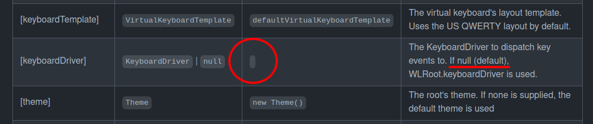

# canvas-ui-wl

Wonderland Engine integration for the
[canvas-ui](https://github.com/playkostudios/canvas-ui) Typescript UI library.

Documentation is available in the [docs.md file](docs.md). Note that this
project uses JSDoc to generate documentation and there is a bug with default
parameter values
[where null is not shown](https://github.com/jsdoc2md/jsdoc-to-markdown/issues/170#issuecomment-452292087),
so every time there is a default value that looks like an empty string in the
documentation, its a null value:

Documentation for canvas-ui is available in the
[canvas-ui repository](https://github.com/playkostudios/canvas-ui).

## Setup

1. Install the canvas-ui NPM package: `npm install --save-dev git@github.com:playkostudios/canvas-ui.git`
2. Install this NPM package: `npm install --save-dev git@github.com:playkostudios/canvas-ui-wl.git`
3. `require` `canvas-ui` and `canvas-ui-wl` in your bundle script
4. Create a new component for your UI root ([see examples section](#Examples))
5. Set the material to use for your UI root component to a textured material. If you want semi-transparent background, create a new pipeline with alpha blending enabled

## Examples

Example usage can be found in
[example-components](https://github.com/playkostudios/canvas-ui-wl/tree/master/example-components).

A default virtual keyboard component, `virtual-keyboard-ui-root`, is supplied.
The implementation can be found in
[src/components/virtual-keyboard-ui-root.js](https://github.com/playkostudios/canvas-ui-wl/blob/master/src/components/virtual-keyboard-ui-root.js).